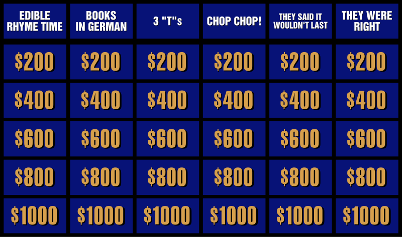

# React Jeopardy

Jeopardy is an American game show created by [Merv Griffin](https://en.wikipedia.org/wiki/Merv_Griffin). The show is a quiz competition that reverses the traditional question-and-answer format of many quiz shows. Rather than being given questions, contestants are instead given general knowledge clues in the form of answers and they must identify the person, place, thing, or idea that the clue describes, phrasing each response in the form of a question. Jeopardy Game that allows you to fully interact with the UI and have some fun.

Here's the original layout from the game board since November 26, 2001: 

<div align="center">
    
</div>

## Table of Contents

1. [About the Project](#about-the-project)
<!-- 1. [Project Status](#project-status) -->
1. [Getting Started](#getting-started)
    1. [Dependencies](#dependencies)
    1. [Usage](#usage)
<!-- 1. [Contributing](#contributing) -->
1. [Further Reading](#further-reading)
<!-- 1. [License](#license) -->
1. [Authors](#authors)
1. [Acknowledgments](#acknowledgements)

## About the Project

<!-- Here you can provide more details about the project
* What features does your project provide?
* Short motivation for the project? (Don't be too long winded)
* Links to the project site

```
Show some example code to describe what your project does
Show some of your APIs
``` -->

This project was created during a live stream of an #100Devs Community Stream Event on twitch by @mayanwolfe
We learned how to use Vite + React as a building tool to provide a faster and leaner development experience for modern web projects.

### Built With
In React Jeopardy we used various tools to create this app such as:

* [![Vite][Vite.js]][Vite-url]
* [![React][React.js]][React-url]


**[Back to top](#table-of-contents)**

<!-- ## Project Status

Show the build status if you have a CI server:

[](http://your-server/job/badge/icon/)

Describe the current release and any notes about the current state of the project. Examples: currently compiles on your host machine, but is not cross-compiling for ARM, APIs are not set, feature not implemented, etc.

**[Back to top](#table-of-contents)** -->

## Getting Started

<!-- This section should provide instructions for other developers to

These instructions will get you a copy of the project up and running on your local machine for development and testing purposes. See deployment for notes on how to deploy the project on a live system. -->

To get started with this project first set up your project locally. To get a local copy refer to **[Get the Source](#get-the-source)**

### Prerequisites
Some required things you'll need to know before doing this project:
- NPM (Node Package Manager)
- NodeJS (How to create a server using cors and express?)
- React (Passing Props & Hooks)


### Dependencies

Software and libraries you will need to install in order to build and use this project. 

Remember: `git-lfs` is a dependency that developers will need to resolve before they can get started with a repository using LFS.

```
Examples should be included
```
- [Vite](https://vitejs.dev/guide/)
- [Cors](https://www.npmjs.com/package/cors)
- [![Express][Express.js]][Express-url]

### Getting the Source

This project is [hosted on GitHub](https://github.com/dyarawilliams/react-jeopardy). You can clone this project directly using this command:

For SSH:
```
git clone git@github.com:dyarawilliams/react-jeopardy.git
```

or 

For HTTPS:
```
git clone https://github.com/dyarawilliams/react-jeopardy.git
```

### Installation

Instructions for how to install this project's build artifacts

<!-- ```
Examples should be included
``` -->

With NPM:

```
npm create vite@latest
```

With Yarn:

```
$ yarn create vite
```

With PNPM:

```
$ pnpm create vite
```

Then follow the prompts!

### Usage

<!-- Instructions for using your project. Ways to run the program, how to include it in another project, etc.

```
Examples should be included
```

If your project provides an API, either provide details for usage in this document or link to the appropriate API reference documents  -->

To use this project you can run it by running two seperate terminals:

First run, 

```
npm run server
```

In the second terminal run: 

```
npm run dev
```

**[Back to top](#table-of-contents)**

<!-- ## Contributing

Provide details about how people can contribute to your project. If you have a contributing guide, mention it here. e.g.:

We encourage public contributions! Please review [CONTRIBUTING.md](docs/CONTRIBUTING.md) for details on our code of conduct and development process.

**[Back to top](#table-of-contents)**

## Further Reading

Provide links to other relevant documentation here

**[Back to top](#table-of-contents)**

## License

Copyright (c) 2023

This project is licensed under the XXXXXX License - see [LICENSE.md](LICENSE.md) file for details.

**[Back to top](#table-of-contents)** -->

## Authors

* **[D'yara Williams](https://github.com/dyarawilliams)** - *Initial work* - [Claire](https://github.com/Mayanwolfe)

Also see the list of [contributors](https://github.com/dyarawilliams/react-jeopardy/contributors) who participated in this project.

**[Back to top](#table-of-contents)**

## Acknowledgments

<!-- Provide proper credits, shout-outs, and honorable mentions here. Also provide links to relevant repositories, blog posts, or contributors worth mentioning. -->

* BIG Thank You to [mayanwolfe's Repo](https://github.com/Mayanwolfe/React_Jeopardy) for comming through on this beautiful day 8/6/23 to share some insight on this project and helping us walk through it. 

* Shout out to [scottenad](https://github.com/sottenad) for creating such an awesome API for the classic game Jeopardy


**[Back to top](#table-of-contents)**

<!-- MARKDOWN LINKS & IMAGES -->
<!-- https://www.markdownguide.org/basic-syntax/#reference-style-links -->
[Vite.js]: https://img.shields.io/badge/Vite-B73BFE?style=for-the-badge&logo=vite&logoColor=FFD62E
[Vite-url]: https://vitejs.dev/

[React.js]: https://img.shields.io/badge/React-20232A?style=for-the-badge&logo=react&logoColor=61DAFB
[React-url]: https://reactjs.dev/

[Express.js]: https://img.shields.io/badge/Express%20js-000000?style=for-the-badge&logo=express&logoColor=white
[Express-url]: https://www.npmjs.com/package/express
